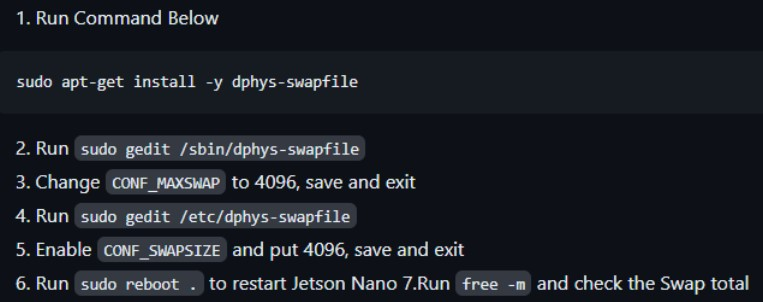
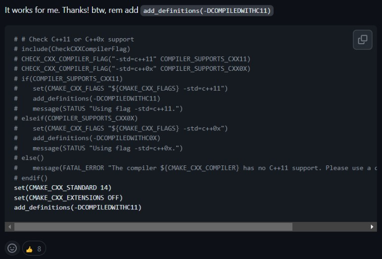
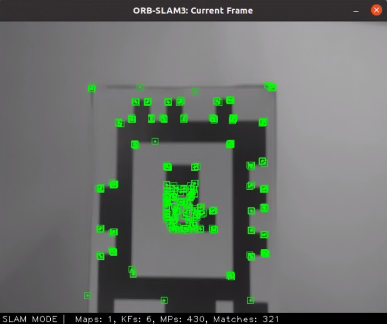

This is a fork of the ORBSLAM3 repository.
System: Jetson Nano, 4GB RAM, with IMX219 (‘Arducam 8MP Camera v2.2’)
	Cooler fan is required. Otherwise thermal throttling comes in very quickly.

### Current State
Most if not all other implementations of ORBSLAM3 are processed on a much more capable setup than the Jetson, or are streaming their camera feed to a remote computer for processing. Our fork (as of end of 2023, on the Jetson) is not ready for use yet - it does not track well, and new tracked points only appear after significant time standing still (~1 minute, not sure what determines it). 

The sections below go through installation on the Jetson system, but should remain largely the same for compilation on other platforms (esp. Raspberry Pi, except the camera would be handled differently).

### Enlarging the Swap file (‘[download more RAM!](https://knowyourmeme.com/memes/download-more-ram)’)
The Jetson only has 4GB of RAM and 2GB of something called ZRAM. Potentially during the installation of dependencies and definitely when building the ORBSLAM library and executables, you would need more. 

I enlarged the swap file for the system in order to make more ‘RAM’ available. Obviously this is not real RAM, and disk operations are very slow, hence operations using swap space is dramatically slower. But it makes these builds possible.

Follow posts on google to increase the swap size. I used the steps below (found [here](https://www.google.com/url?q=https://gist.github.com/hansheng0512/97af6f988ad24291e5a94e5caeee1e2c&sa=D&source=docs&ust=1702074012900640&usg=AOvVaw1d8GpiF44GvZ5ihz1eMBCn))and specified 4096 = 4GB of swap, then increased it to 8192 = 8GB of swap when building with Debug symbols (GDB doesn’t run properly on the Jetson, so this isn’t useful). 4GB of swap should be enough for everything used in ORBSLAM. 



Keep in mind that this takes up disk space - it is best to use a >32GB card, otherwise this may cause you to run out of disk space as the ORBSLAM source + builds are multiple gigabytes as well.

### TOP
It’s always a good idea to monitor the resources in use. For the jetson, [jtop](https://jetsonhacks.com/2023/02/07/jtop-the-ultimate-tool-for-monitoring-nvidia-jetson-devices/) is a very nicely made resource/system monitor. Otherwise, htop would be a go-to.

### Dependencies
Install **Pangolin** using instructions at https://github.com/stevenlovegrove/Pangolin. 
Checkout latest tag and compile (takes ~20 mins). In my case ninja-build was already installed:

```bash
git clone --recursive https://github.com/stevenlovegrove/Pangolin.git
cd Pangolin
git checkout v0.8
./scripts/install_prerequisites.sh recommended
# Build with Ninja
cmake -B build -GNinja
cmake --build build
```

**OpenCV** was previously installed based on the ROB550 image. This can also be done using the script at https://github.com/mdegans/nano_build_opencv with all CUDA options disabled and using only one core (RAM bound; enlarge SWAP if needed, see above section). In my case, OpenCV 4.4.0 with no CUDA was installed.

**Eigen3** was already installed on my image, but can be installed using apt.

**Python2** was already installed and contains **numpy** as requested.

(not mentioned in guide) install **libboost serialization**:
`sudo apt install libboost-serialization-dev`

### Building ORBSLAM3
A known issue (https://github.com/UZ-SLAMLab/ORB_SLAM3/issues/387 error: ‘slots_reference’ was not declared in this scope) will fail your build unless you modify the CMakeLists.txt in the ORBSLAM3 repo to use c++14 instead of c++11 for compilation. 
Modify the CMakeLists.txt like so (already done in our fork of the repository):



We are also once again memory bound (which will result in it saying something was killed by signal). Change the build.sh shell to use one thread only (`-j1`) (already done in our fork).

This takes a little while so be prepared to go do something else for an hour. Make sure you have enlarged the swap beforehand so it doesn’t grind to a complete halt or get killed by out-of-memory (OOM).

### Calibration
Using the pinhole model, all we need is the camera’s intrinsic matrix and the distortion parameters. Either follow their guide for calibration, or just use the camera calibration script in ROB550 (for the apriltag example, where we calibrate with a chessboard). Input those to a yaml following the t265 camera example under Examples/Monocular. The camera specs for the camera I had used is under `Examples/Monocular/PiCamera.yaml``.

### Code
The code itself is relatively straightforward, especially since we are just adapting code from the t265 and using `nvargus` instead of their pipeline. An example using the Pi camera and monocular tracking is under `Examples/Monocular/mono_mbot.cc`.

After building, start the executable by running: (one long command)
```bash
./Examples/Monocular/mono_mbot ./Vocabulary/ORBvoc.txt ./Examples/Monocular/PiCamera.yaml <optional-file-to-save-trajectory>
```

It is best to shutdown anything more complicated than a terminal when running this (e.g. VSCode). It uses most of the CPU and 0.5~1GB of RAM.

The state of the tracking system is printed every frame. This is defined in System.cc, but always references the state of the Tracking thread in `Tracking.cc`.

### Performance concerns and where to go next
This example tracks in some cases (especially when something with high contrast such as an AprilTag is present). However, it is incredibly finicky, and does not track well when rotated. This mainly is because new features are not created fast enough, which means as soon as all of the original descriptors go out of frame quickly (which is any reasonable movement by the motors of the bot), tracking gets killed.

Existing results for the Jetson TX2 (which is ‘2.5x faster than the jetson nano’) in [this paper](https://www.researchgate.net/publication/365725945_Visual_SLAM_for_Autonomous_Drone_Landing_on_a_Maritime_Platform) shows that ORBSLAM3 tracks a monocular camera at 376p at 20FPS, which implies that the expected framerate for our machine would be around 8FPS. We’re actually doing better than expected, as the current 640x480 setup (when it tracks) goes around 10FPS, but we’re not really moving around.

When it works, the current frame updates with the pixels it is tracking.



The code doesn’t have too much that can be modified - the `SLAM.TrackMonocular()` function is all we should call. It comes down to tuning parameters of different types instead. We want to hit a good balance on the number of features versus performance. Too many features, and it would lag significantly; But too few features, and ORBSLAM 3 internal tracking thresholds do not get met (number of matches between frames, for example), and tracking fails.

Here are to my knowledge things that can be tuned:

* Image width/height: currently 640x480. Modify in mono_mbot.cc and PiCamera.yaml to match.

* Desired framerate: I put 30 in both files, but usually does not go above 12 in the best case.

* enable_UI: true, just to grab the camera preview. I’d imagine it would be useful to disable once everything is tuned properly, but FPS does not seem to be affected too much.

* min/maxExposurens: To bound the exposure times for every frame, since I suspected motion blur as being a major problem.

* ORBextractor.nFeatures: number of features per image. Not sure if more is better because they allow more matches, or worse because it takes longer.

* ORBextractor.ini/minThFAST: threshold for corner detection. Already dramatically lowered. See EuRoC.yaml for what initial values were.

* Physical camera focus: Make sure the image is not blurry.

With the advent of the RPi 5, and just Moore's law in general, some day this will be comfortably run on an MBot. 

Thanks for reading! - Tom Gao